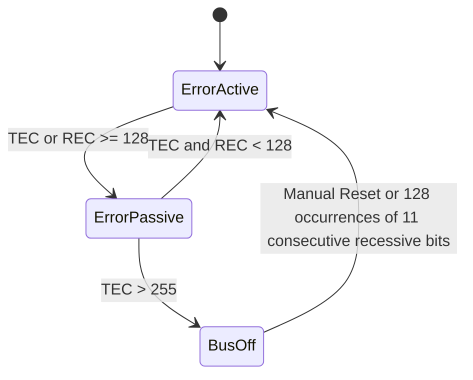
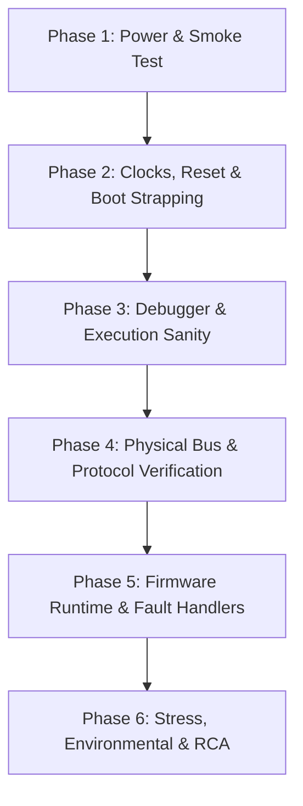

# Embedded Systems Engineering Reference Guide
**Topics:** CAN Protocol, Embedded Debugging Flow, WebSockets, and MQTT  
**Target Audience:** Embedded Hardware, Firmware, and IoT Engineers

---

## Table of Contents
1. [CAN (Controller Area Network) Protocol Deep Dive](#1-can-controller-area-network-protocol-deep-dive)
   - [Core Architecture & Philosophy](#11-core-architecture--philosophy)
   - [Physical Layer & Differential Signaling](#12-physical-layer--differential-signaling)
   - [Non-Destructive Bitwise Arbitration](#13-non-destructive-bitwise-arbitration)
   - [CAN 2.0A Frame Anatomy](#14-can-20a-frame-anatomy)
   - [Bit Stuffing & Fault Confinement](#15-bit-stuffing--fault-confinement)
   - [Firmware Implementation Checklist](#16-firmware-implementation-checklist)
2. [Embedded Product Debugging Flow](#2-embedded-product-debugging-flow)
   - [Phase 1: Physical & Power Rail Sanity ("Smoke Test")](#phase-1-physical--power-rail-sanity-the-smoke-test)
   - [Phase 2: Clocks, Reset & Boot Configurations](#phase-2-clocks-reset--boot-configurations)
   - [Phase 3: Debugger & Execution Sanity](#phase-3-debugger--execution-sanity)
   - [Phase 4: Peripheral & Protocol Bus Validation](#phase-4-peripheral--protocol-bus-validation)
   - [Phase 5: Firmware Runtime & Exception Debugging](#phase-5-firmware-runtime--exception-debugging)
   - [Phase 6: Stress, Environmental & Root Cause Analysis](#phase-6-stress-environmental--root-cause-analysis-rca)
3. [WebSocket Protocol](#3-websocket-protocol)
   - [Overview & Comparison to HTTP](#31-overview--comparison-to-http)
   - [Operating Lifecycle & Handshake](#32-operating-lifecycle--handshake)
   - [Binary Framing Protocol](#33-binary-framing-protocol)
   - [Embedded & IoT Use Cases](#34-embedded--iot-use-cases)
4. [MQTT (Message Queuing Telemetry Transport)](#4-mqtt-message-queuing-telemetry-transport)
   - [Architecture: Publish / Subscribe Pattern](#41-architecture-publish--subscribe-pattern)
   - [Topics & Wildcards](#42-topics--wildcards)
   - [Quality of Service (QoS) Levels](#43-quality-of-service-qos-levels)
   - [Key Embedded Features (LWT, Retained, Keep-Alive)](#44-key-embedded-features)
   - [Packet Anatomy & Firmware Stack](#45-packet-anatomy--firmware-stack)

---

## 1. CAN (Controller Area Network) Protocol Deep Dive

### 1.1 Core Architecture & Philosophy
Unlike master-slave protocols (like SPI or I2C) or point-to-point buses (like UART):
* **Multi-Master Broadcast Bus:** Any node can transmit when the bus is idle.
* **Message-Centric, Not Node-Centric:** Nodes do not have MAC or network addresses. Instead, every message contains an **Identifier (ID)** representing its content (e.g., `0x100` = Battery Voltage).
* **Hardware Filtering:** Nodes use hardware acceptance filters to automatically ingest or reject frames without loading the MCU core.
* **Priority-Driven:** Lower CAN ID numerical value = Higher priority (`0x000` is the highest possible priority).

---

### 1.2 Physical Layer & Differential Signaling
CAN runs over a balanced twisted pair (**CAN_H** and **CAN_L**) terminated at each physical extreme with a **$120\,\Omega$ resistor** ($60\,\Omega$ equivalent bus impedance).

| State | Logic Level | CAN_H (Typ) | CAN_L (Typ) | Differential ($\Delta V$) | Behavior |
| :--- | :--- | :--- | :--- | :--- | :--- |
| **Dominant** | **`0`** | $\approx 3.5\text{ V}$ | $\approx 1.5\text{ V}$ | $\approx +2.0\text{ V}$ | Actively driven by transceiver |
| **Recessive** | **`1`** | $\approx 2.5\text{ V}$ | $\approx 2.5\text{ V}$ | $\approx 0.0\text{ V}$ | Driven passively by termination |

> **Wired-AND Logic:** If Node 1 sends Dominant (`0`) and Node 2 sends Recessive (`1`) at the same instant, the bus state is **Dominant (`0`)**. Dominant always overrides Recessive.

---

### 1.3 Non-Destructive Bitwise Arbitration
Unlike Ethernet (CSMA/CD), where collisions cause packet drops and back-off delays, CAN never drops bandwidth on collision:
1. Two nodes transmit their Start of Frame (SOF) simultaneously.
2. Both transmit their Identifier bits one by one while monitoring the physical bus line via their receiver.
3. As long as their bits match, both continue.
4. When one node sends a Recessive `1` while another node sends a Dominant `0`:
   - The transmitting node of `1` detects a `0` on the bus.
   - It detects arbitration loss, **immediately disables its transmitter**, and switches to listener mode.
5. The higher-priority frame continues along the bus without corruption or delay.

---

### 1.4 CAN 2.0A Frame Anatomy

```text
+-----+---------------+-----+-----+----+-----+--------------------+-----+-----+-----+-----+
| SOF | Identifier    | RTR | IDE | r0 | DLC | Payload Data       | CRC | ACK | EOF | IFS |
| 1 b | 11 bits       | 1 b | 1 b | 1b | 4 b | 0 to 8 Bytes       | 16b | 2 b | 7 b | 3 b |
+-----+---------------+-----+-----+----+-----+--------------------+-----+-----+-----+-----+
```

* **SOF (Start of Frame):** 1 dominant bit for hard clock synchronization.
* **Identifier:** 11 bits (CAN 2.0A) or 29 bits (CAN 2.0B Extended).
* **RTR (Remote Transmission Request):** `0` for normal data frame, `1` for remote request frame.
* **IDE (Identifier Extension):** `0` for standard 11-bit ID, `1` for extended 29-bit ID.
* **DLC (Data Length Code):** 4 bits indicating payload length ($0$ to $8$ bytes).
* **CRC Field:** 15-bit cyclic redundancy check sequence + 1 recessive delimiter bit.
* **ACK Field:** 
  - Transmitter outputs a recessive bit (`1`).
  - Any node that received the frame validly pulls the line dominant (`0`).
* **EOF (End of Frame):** 7 consecutive recessive bits.
* **IFS (Interframe Space):** 3 consecutive recessive bits before the next transmission can start.

---

### 1.5 Bit Stuffing & Fault Confinement

#### Bit Stuffing
* If a transmitter sends **5 consecutive identical bits**, the controller hardware automatically inserts an opposite complementary bit (the "stuff bit").
* Receivers discard stuff bits automatically.
* Ensures regular signal edges to prevent drift in node oscillator synchronization.

#### Fault Confinement Counters
Every CAN controller maintains:
* **TEC (Transmit Error Counter)**
* **REC (Receive Error Counter)**



1. **Error Active (Normal):** Can transmit active error flags (6 dominant bits).
2. **Error Passive:** Can only transmit passive error flags (6 recessive bits), preventing it from interrupting other nodes.
3. **Bus Off:** Completely disconnected from the physical bus. Prevents a damaged MCU from monopolizing the bus.

---

### 1.6 Firmware Implementation Checklist
1. **Physical Resistance:** Verify $60\,\Omega$ resistance across CAN_H and CAN_L with board unpowered.
2. **Transceiver Pins:** Check if transceiver `STBY` / `RS` pin is pulled low (silent mode disabled).
3. **Bit Timing Quanta ($t_q$):**
   $$\text{Nominal Bit Time} = \text{Sync\_Seg} + \text{Prop\_Seg} + \text{Phase\_Seg1} + \text{Phase\_Seg2}$$
   Ensure the sample point is between **$75\%$ and $87.5\%$**.
4. **Acceptance Filtering:** Configure ID and Mask registers properly so only necessary frames trigger interrupts.

---

## 2. Embedded Product Debugging Flow

> **The Golden Rule:** Never debug firmware on unverified hardware.



---

### Phase 1: Physical & Power Rail Sanity (The "Smoke Test")
* **Bench Power Supply Current Limit:** Set current limit before turning on a new board.
  - *Excessive current draw:* Shorted capacitor, reversed diode, or upside-down IC.
  - *0 mA / Near zero:* Blown fuse, inactive buck/LDO regulator enable pin, or cold solder joint.
* **Rail Voltage Checks (DMM):** Check $5\text{V}$, $3.3\text{V}$, $1.8\text{V}$, and $1.2\text{V}$ core voltages against $\pm 5\%$ tolerance.
* **Thermal Inspection:** Use a thermal camera or touch test to locate unexpectedly hot components.

---

### Phase 2: Clocks, Reset & Boot Configurations
* **Reset Line (`NRST`):** Verify it is pulled high (for active-low MCU reset). Floating reset lines cause intermittent brownout cycles.
* **Oscillator / Crystals:** Probe external crystals (HSE/LSE) with an oscilloscope (using a 10x high-impedance probe) to verify clean sine/square waves.
* **Boot Strapping Pins:** Ensure `BOOT0`/`BOOT1` are tied correctly to boot from internal Flash rather than System Bootloader (ROM) or SRAM.

---

### Phase 3: Debugger & Execution Sanity
* **SWD / JTAG Connectivity:**
  - Can J-Link or ST-Link read the MCU Device ID (`IDCODE`)?
  - If failing, reduce SWD clock frequency (e.g., from 4 MHz to 500 kHz) to mitigate trace capacitance.
* **Minimal Blinky Firmware:** Flash a minimal bare-metal LED blinky or raw UART output to prove the entire toolchain: Flash $\rightarrow$ Core $\rightarrow$ Clock Tree $\rightarrow$ GPIO.

---

### Phase 4: Peripheral & Protocol Bus Validation
Always verify signals on the wire using a **Logic Analyzer** or **Digital Oscilloscope**:

* **UART:** Check for TX/RX crossover, incorrect baud rate (>3% clock drift produces framing errors), and 3.3V TTL vs. RS-232 level mismatches.
* **$\text{I}^2\text{C}$:**
  - Verify physical pull-up resistors are installed ($2.2\,\text{k}\Omega - 4.7\,\text{k}\Omega$).
  - Confirm 7-bit addressing left-shift (`(addr << 1) | rw`).
  - Watch for bus freeze caused by a slave holding SDA low (resolve by clocking SCL 9 times).
* **SPI:** Confirm CPOL/CPHA mode matches the target slave datasheet; confirm Chip Select (`CS`) stays asserted throughout the multi-byte transfer.
* **CAN:** Verify differential voltages ($2.5\text{V}$ recessive vs. $3.5\text{V}/1.5\text{V}$ dominant) and bit-timing prescalers.

---

### Phase 5: Firmware Runtime & Exception Debugging
* **ARM Cortex-M Fault Registers:**
  - On HardFault, inspect:
    - `CFSR` (Configurable Fault Status Register)
    - `HFSR` (HardFault Status Register)
    - `MMFAR` / `BFAR` (Memory Management / Bus Fault Address Registers)
  - Inspect the Stack Pointer (`MSP`/`PSP`) and Link Register (`LR` / `EXC_RETURN`) to determine the exact Program Counter (`PC`) where the exception occurred.
* **FreeRTOS / RTOS Debugging:**
  - **Stack Overflow:** Enable `configCHECK_FOR_STACK_OVERFLOW = 2` and inspect `vApplicationStackOverflowHook()`.
  - **Deadlock / Priority Inversion:** Audit mutex acquisition and verify priority inheritance is enabled.
  - **Interrupt Violations:** Ensure FreeRTOS API calls in ISRs use `FromISR` variants and respect `configMAX_SYSCALL_INTERRUPT_PRIORITY`.
* **Data Races:** Check for variables shared between ISRs and threads that lack the `volatile` keyword or atomic guards.

---

### Phase 6: Stress, Environmental & Root Cause Analysis (RCA)
* **Power Cycling / Brownout:** Test behavior under slow voltage decay; ensure internal Brown-Out Detector (BOD) cleanly holds the core in reset.
* **Thermal Chamber / Stress:** Run under high processor loads and extreme temperatures to expose timing race conditions or oscillator drift.
* **Document RCA:** Reproduce reliably, isolate the root cause, verify across multiple board lots, and document in the team issue tracker.

---

## 3. WebSocket Protocol

### 3.1 Overview & Comparison to HTTP
* **RFC 6455 Standard:** Full-duplex, bidirectional, persistent communication channel over a single TCP connection.
* **Port Compatibility:** Uses standard ports (`80` for `ws://`, `443` for `wss://`), making it friendly with firewalls and reverse proxies.

| Metric | HTTP/1.1 | WebSocket |
| :--- | :--- | :--- |
| **Model** | Half-duplex (Request / Response) | Full-duplex (Both can send at will) |
| **Connection** | Disconnects or Keep-Alive polling | Single persistent connection |
| **Server Push** | Requires polling or SSE | Native |
| **Frame Overhead** | Hundreds of bytes of headers | 2 to 10 bytes |

---

### 3.2 Operating Lifecycle & Handshake

#### Step 1: HTTP Upgrade Request (Client $\rightarrow$ Server)
```http
GET /stream HTTP/1.1
Host: gateway.local
Upgrade: websocket
Connection: Upgrade
Sec-WebSocket-Key: dGhlIHNhbXBsZSBub25jZQ==
Sec-WebSocket-Version: 13
```

#### Step 2: Protocol Switch Response (Server $\rightarrow$ Client)
The server combines `Sec-WebSocket-Key` with the UUID `258EAFA5-E914-47DA-95CA-C5AB0DC85B11`, hashes it with SHA-1, and base64 encodes it:
```http
HTTP/1.1 101 Switching Protocols
Upgrade: websocket
Connection: Upgrade
Sec-WebSocket-Accept: s3pPLMBiTxaQ9kYGzzhZRbK+xOo=
```

#### Step 3: Bi-directional Data Streaming
The HTTP parser is detached, and the TCP socket directly passes binary frames.

---

### 3.3 Binary Framing Protocol

```text
 0                   1                   2                   3
 0 1 2 3 4 5 6 7 8 9 0 1 2 3 4 5 6 7 8 9 0 1 2 3 4 5 6 7 8 9 0 1
+-+-+-+-+-------+-+-------------+-------------------------------+
|F|R|R|R| opcode|M| Payload len |    Extended payload length    |
|I|S|S|S|  (4)  |A|     (7)     |             (16/64)           |
|N|V|V|V|       |S|             |   (if payload len==126/127)   |
+-+-+-+-+-------+-+-------------+ - - - - - - - - - - - - - - - +
|     Masking-key (0 or 4 bytes) (if MASK bit is set)           |
+-------------------------------+-------------------------------+
|                     Payload Data (variable)                   |
+---------------------------------------------------------------+
```

* **FIN (1 bit):** Indicates if this frame is the final fragment of the message.
* **Opcode (4 bits):**
  - `0x1`: Text data (UTF-8)
  - `0x2`: Binary data
  - `0x8`: Connection Close
  - `0x9`: Ping
  - `0xA`: Pong
* **MASK (1 bit):**
  - **All client-to-server frames MUST be masked** with a 4-byte random key to protect proxy servers from cache poisoning.
  - Server-to-client frames are **unmasked**.

---

### 3.4 Embedded & IoT Use Cases
* **Local MCU Web Dashboards:** Running embedded web servers (e.g., `mongoose`, `libwebsockets`, or ESP32 `esp_http_server`) to stream real-time motor RPM, ADC sensors, and device statuses directly to browser dashboards at high frame rates.
* **Direct Cloud Ingestion:** Pushing binary telemetry to cloud services that accept WebSockets without needing an external MQTT broker.

---

## 4. MQTT (Message Queuing Telemetry Transport)

### 4.1 Architecture: Publish / Subscribe Pattern
MQTT is an extremely lightweight, publish-subscribe protocol designed for low-bandwidth, battery-powered, or unreliable network connections.

```text
[ Sensor Node (Publisher) ]  --- PUBLISH: "device/1/temp" ---> [               ]
                                                                [  MQTT Broker  ] ---> Delivers to:
[ Actuator (Subscriber)   ]  <-- SUBSCRIBE: "device/1/temp" -- [  (Mosquitto / ]      - Cloud Logger
                                                                [   EMQX)       ]      - Web UI / App
```

* **Spatial Decoupling:** Senders and receivers do not need each other's IP addresses.
* **Temporal Decoupling:** Messages can be stored and forwarded even if the subscriber is temporarily offline.
* **Synchronization Decoupling:** All operations are asynchronous.

---

### 4.2 Topics & Wildcards
Topics are hierarchical strings using forward slashes:
`vvdn/floor2/device42/sensor/temperature`

* **Single-Level Wildcard (`+`):** Matches exactly one level.
  - `vvdn/floor2/+/sensor/temperature` matches `device42`, `device43`, etc.
* **Multi-Level Wildcard (`#`):** Matches any number of sub-levels (must be at the end).
  - `vvdn/floor2/#` matches all topics published within `floor2`.
* **Broker Metrics (`$SYS/`):** Reserved for broker internal telemetry (e.g., `$SYS/broker/clients/connected`).

---

### 4.3 Quality of Service (QoS) Levels

| QoS Level | Name | Handshake Mechanism | Suitable Use Case |
| :--- | :--- | :--- | :--- |
| **QoS 0** | **At most once** ("Fire & forget") | Single `PUBLISH`, no ACK. | Periodic sensor streams (e.g., temperature every 2s) where dropped samples are acceptable. |
| **QoS 1** | **At least once** | `PUBLISH` $\rightarrow$ `PUBACK`. Retransmitted if ACK times out. Can cause duplicate delivery. | State change events, alarms, door open alerts. |
| **QoS 2** | **Exactly once** | 4-way handshake: `PUBLISH` $\rightarrow$ `PUBREC` $\rightarrow$ `PUBREL` $\rightarrow$ `PUBCOMP`. Zero loss, zero duplicates. | Billing, critical control commands, OTA firmware updates. |

---

### 4.4 Key Embedded Features

#### A. Last Will and Testament (LWT)
* Specified in the initial `CONNECT` packet (Topic: `device/123/status`, Payload: `"offline"`).
* If the device is disconnected ungracefully (loss of power, network drop), the **broker automatically broadcasts the LWT message** to alert other clients.

#### B. Retained Messages
* When published with `Retain = 1`, the broker stores the message permanently.
* New subscribers immediately receive this last known state upon subscription, without waiting for the next periodic broadcast.

#### C. Keep-Alive & Ping Mechanism
* The client specifies a Keep-Alive interval (e.g., 60 seconds).
* If no application frames are sent, the client transmits a 2-byte `PINGREQ`.
* The broker replies with a 2-byte `PINGRESP`. If missing past $1.5\times$ interval, connection is severed and LWT triggers.

---

### 4.5 Packet Anatomy & Firmware Stack

#### Packet Anatomy
* **Fixed Header (2 to 5 bytes):** Byte 1 contains Packet Type (4 bits) + Flags (DUP, QoS, Retain). Bytes 2–5 contain Remaining Length encoded as a variable-length integer.
* **Variable Header:** Present in certain packets (Packet Identifier for QoS 1/2, Topic Name).
* **Payload:** Binary agnostic (JSON, Protobuf, CBOR, or raw C structs).

#### Recommended Embedded Implementations:
* **Eclipse Paho Embedded C:** Minimal RAM/ROM footprint for bare-metal / FreeRTOS.
* **CoreMQTT:** FreeRTOS-native, highly auditable library for AWS IoT / Azure IoT.
* **esp-mqtt:** Standard component in ESP-IDF.
* **Security:** Use **mTLS (Mutual TLS)** over port `8883` with hardware-backed secure elements (e.g., ATECC608 or internal MCU crypto hardware).
